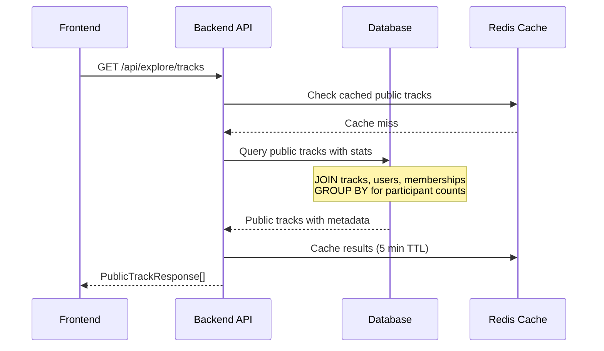
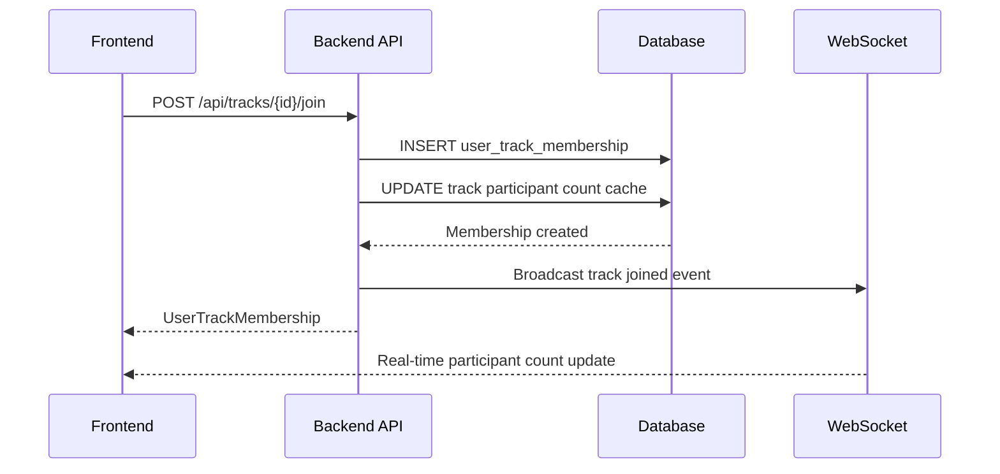
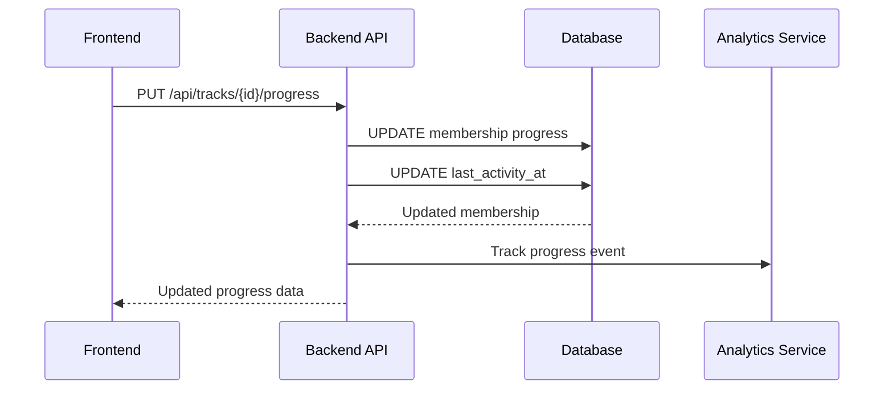

# Explore Page - High Level Design

## 🎯 Overview

The Explore Page enables users to discover and join public tracks created by the community. This design implements a normalized database architecture that supports reusable track items, community participation, and social features.

## 🗄️ Database Schema Design

### Core Tables

#### 1. `track_items` - Reusable Articles/Content
```sql
CREATE TABLE track_items (
    id VARCHAR PRIMARY KEY DEFAULT gen_random_uuid(),
    title VARCHAR NOT NULL,
    url VARCHAR NOT NULL,  -- Wikipedia URL
    description TEXT,
    created_at TIMESTAMP NOT NULL DEFAULT NOW(),
    updated_at TIMESTAMP NOT NULL DEFAULT NOW()
);

CREATE INDEX idx_track_items_title ON track_items(title);
CREATE INDEX idx_track_items_url ON track_items(url);
```

**Key Benefits:**
- Single source of truth for each Wikipedia article
- Eliminates duplicate content across tracks
- Enables content analytics (most popular articles)
- Supports content updates affecting all tracks using that item

#### 2. `tracks` - Updated Track Model
```sql
ALTER TABLE tracks
ADD COLUMN is_public BOOLEAN NOT NULL DEFAULT false,
DROP COLUMN articles;  -- Remove JSON field

CREATE INDEX idx_tracks_public ON tracks(is_public);
CREATE INDEX idx_tracks_public_created ON tracks(is_public, created_at);
```

**Changes:**
- Add `is_public` flag for community tracks
- Remove `articles` JSON column (replaced by normalized relationships)
- Add indexes for efficient public track queries

#### 3. `track_item_associations` - Many-to-Many Junction
```sql
CREATE TABLE track_item_associations (
    id VARCHAR PRIMARY KEY DEFAULT gen_random_uuid(),
    track_id VARCHAR NOT NULL REFERENCES tracks(id) ON DELETE CASCADE,
    track_item_id VARCHAR NOT NULL REFERENCES track_items(id) ON DELETE CASCADE,
    order_index INTEGER NOT NULL,
    created_at TIMESTAMP NOT NULL DEFAULT NOW(),

    UNIQUE(track_id, track_item_id),
    UNIQUE(track_id, order_index)
);

CREATE INDEX idx_track_item_track ON track_item_associations(track_id);
CREATE INDEX idx_track_item_item ON track_item_associations(track_item_id);
CREATE INDEX idx_track_item_order ON track_item_associations(track_id, order_index);
```

**Features:**
- Links tracks to their constituent items
- Maintains article order within each track
- Prevents duplicate items within a track
- Ensures consistent ordering

#### 4. `user_track_memberships` - Community Participation
```sql
CREATE TABLE user_track_memberships (
    id VARCHAR PRIMARY KEY DEFAULT gen_random_uuid(),
    user_id VARCHAR NOT NULL REFERENCES users(id) ON DELETE CASCADE,
    track_id VARCHAR NOT NULL REFERENCES tracks(id) ON DELETE CASCADE,
    joined_at TIMESTAMP NOT NULL DEFAULT NOW(),
    progress JSONB DEFAULT '{}',  -- Track completion progress
    is_active BOOLEAN NOT NULL DEFAULT true,
    last_activity_at TIMESTAMP DEFAULT NOW(),

    UNIQUE(user_id, track_id)
);

CREATE INDEX idx_membership_user ON user_track_memberships(user_id);
CREATE INDEX idx_membership_track ON user_track_memberships(track_id);
CREATE INDEX idx_membership_active ON user_track_memberships(track_id, is_active);
CREATE INDEX idx_membership_activity ON user_track_memberships(last_activity_at);
```

**Progress Structure:**
```json
{
  "completed_items": ["item-id-1", "item-id-3"],
  "current_item": "item-id-2",
  "completion_percentage": 45,
  "last_completed_at": "2024-01-15T10:30:00Z"
}
```

## 🏗️ API Architecture

### New Endpoints

#### Explore & Discovery
```python
# Get public tracks for explore page
GET /api/explore/tracks
Query params: limit, offset, category, sort_by (trending|newest|popular)
Response: List[PublicTrackResponse]

# Get track categories with counts
GET /api/explore/categories
Response: List[CategorySummary]

# Search public tracks
GET /api/explore/search?q={query}&category={category}
Response: List[PublicTrackResponse]
```

#### Community Participation
```python
# Join a public track
POST /api/tracks/{track_id}/join
Response: UserTrackMembership

# Leave a track
DELETE /api/tracks/{track_id}/membership
Response: 204 No Content

# Get user's joined tracks
GET /api/tracks/joined
Response: List[JoinedTrackResponse]

# Update progress on joined track
PUT /api/tracks/{track_id}/progress
Body: { "completed_items": ["item-id"], "current_item": "item-id" }
Response: UserTrackMembership
```

#### Track Management
```python
# Update track visibility
PATCH /api/tracks/{track_id}/visibility
Body: { "is_public": boolean }
Response: TrackResponse

# Get track with community stats
GET /api/tracks/{track_id}/public
Response: PublicTrackDetailResponse
```

### Response Models

#### PublicTrackResponse
```python
class PublicTrackResponse(BaseModel):
    id: str
    title: str
    description: Optional[str]
    creator: UserSummary
    participant_count: int
    recent_participants: List[UserSummary]
    item_count: int
    categories: List[str]
    difficulty: Optional[str]
    estimated_time: Optional[str]
    is_joined: bool  # For current user
    trending: bool
    created_at: datetime
    last_activity: datetime
```

#### JoinedTrackResponse
```python
class JoinedTrackResponse(BaseModel):
    track: PublicTrackResponse
    membership: UserTrackMembership
    progress_percentage: float
    next_item: Optional[TrackItem]
    community_activity: CommunityActivity
```

## 🔄 Data Flow Architecture

### 1. Explore Page Load


### 2. Join Track Flow


### 3. Progress Tracking


## 🚀 Frontend Architecture

### Component Structure
```
ExplorePage/
├── ExploreHeader
├── TrendingSection
│   └── CommunityTrackCard[]
├── StaffPicksSection
│   └── FeaturedTrackCard[]
├── ForYouSection
│   └── RecommendedTrackCard[]
├── CategoryFilter
└── SearchBar

TrackCard Components:
├── CommunityTrackCard
│   ├── TrackMetadata
│   ├── CreatorInfo
│   ├── ParticipantAvatars
│   ├── CommunityStats
│   └── JoinButton
└── TrackProgressCard (for joined tracks)
    ├── ProgressBar
    ├── NextItemPreview
    └── CommunityActivity
```

### State Management
```typescript
interface ExplorePageState {
  // Track listings
  trendingTracks: PublicTrack[]
  staffPicks: PublicTrack[]
  forYouTracks: PublicTrack[]

  // User state
  joinedTracks: Set<string>
  loadingJoin: Set<string>

  // Filters & pagination
  selectedCategory: string | null
  searchQuery: string
  pagination: PaginationState

  // Real-time updates
  participantCounts: Map<string, number>
  recentActivity: Map<string, CommunityActivity[]>
}
```

### Real-time Features
```typescript
// WebSocket connection for live updates
const useRealTimeTracking = () => {
  useEffect(() => {
    const ws = new WebSocket('/ws/explore')

    ws.onmessage = (event) => {
      const { type, data } = JSON.parse(event.data)

      switch(type) {
        case 'participant_joined':
          updateParticipantCount(data.trackId, data.newCount)
          break
        case 'track_completed':
          addCommunityActivity(data.trackId, data.activity)
          break
      }
    }

    return () => ws.close()
  }, [])
}
```

## 🔧 Migration Strategy

### Phase 1: Schema Migration
```sql
-- 1. Create new tables
CREATE TABLE track_items (...);
CREATE TABLE track_item_associations (...);
CREATE TABLE user_track_memberships (...);

-- 2. Add new columns
ALTER TABLE tracks ADD COLUMN is_public BOOLEAN DEFAULT false;
```

### Phase 2: Data Migration
```python
async def migrate_articles_to_items():
    """Convert JSON articles to normalized track_items"""
    tracks = await session.execute(select(Track))

    for track in tracks.scalars():
        for i, article in enumerate(track.articles):
            # Find or create track item
            item = await find_or_create_track_item(
                title=article['title'],
                url=article['url'],
                description=article.get('description')
            )

            # Create association
            association = TrackItemAssociation(
                track_id=track.id,
                track_item_id=item.id,
                order_index=i
            )
            session.add(association)

    await session.commit()
```

### Phase 3: API Updates
1. Update existing endpoints to use new schema
2. Deploy new explore endpoints
3. Update frontend to use new API structure
4. Remove old articles JSON column

### Phase 4: Feature Rollout
1. Enable public track creation
2. Launch explore page with trending
3. Add staff picks curation tools
4. Deploy personalized recommendations

## 📊 Performance Optimizations

### Database Indexes
```sql
-- Composite indexes for common queries
CREATE INDEX idx_tracks_public_trending ON tracks(is_public, created_at DESC)
WHERE is_public = true;

CREATE INDEX idx_membership_stats ON user_track_memberships(track_id, is_active, last_activity_at);

-- Partial indexes for active data
CREATE INDEX idx_active_memberships ON user_track_memberships(track_id)
WHERE is_active = true;
```

### Caching Strategy
```python
# Redis caching patterns
CACHE_KEYS = {
    'trending_tracks': 'explore:trending:{limit}:{offset}',
    'track_participants': 'track:{track_id}:participants',
    'user_joined_tracks': 'user:{user_id}:joined_tracks',
    'track_stats': 'track:{track_id}:stats'
}

# Cache TTLs
CACHE_TTL = {
    'trending_tracks': 300,      # 5 minutes
    'track_participants': 60,     # 1 minute
    'user_joined_tracks': 1800,   # 30 minutes
    'track_stats': 900           # 15 minutes
}
```

### Query Optimization
```sql
-- Efficient participant counting with materialized view
CREATE MATERIALIZED VIEW track_stats AS
SELECT
    t.id,
    t.title,
    t.is_public,
    COUNT(DISTINCT utm.user_id) FILTER (WHERE utm.is_active) as active_participants,
    COUNT(DISTINCT tia.track_item_id) as item_count,
    MAX(utm.last_activity_at) as last_community_activity
FROM tracks t
LEFT JOIN user_track_memberships utm ON t.id = utm.track_id
LEFT JOIN track_item_associations tia ON t.id = tia.track_id
WHERE t.is_public = true
GROUP BY t.id, t.title, t.is_public;

-- Refresh strategy
CREATE INDEX ON track_stats(active_participants DESC, last_community_activity DESC);
REFRESH MATERIALIZED VIEW CONCURRENTLY track_stats;
```

## 🔒 Security & Privacy Considerations

### Access Control
- Public tracks visible to all authenticated users
- Only track owners can modify visibility settings
- Users can only update their own membership progress
- Community stats anonymized (no personal progress visible)

### Privacy Settings
```python
class UserPrivacySettings(SQLModel, table=True):
    user_id: str = Field(foreign_key="users.id", primary_key=True)
    show_in_participant_lists: bool = Field(default=True)
    allow_friend_discovery: bool = Field(default=True)
    public_progress_sharing: bool = Field(default=False)
```

### Rate Limiting
```python
# Join/leave rate limits
@limiter.limit("10 per minute")
async def join_track(...):
    pass

# Progress update limits
@limiter.limit("30 per minute")
async def update_progress(...):
    pass
```

## 📈 Analytics & Monitoring

### Key Metrics
- Track join/leave rates
- Community engagement levels
- Content popularity (which items appear in most tracks)
- User retention in joined tracks
- Trending algorithm effectiveness

### Event Tracking
```python
# Analytics events
analytics.track('track_joined', {
    'track_id': track.id,
    'user_id': user.id,
    'participant_count': track.participant_count,
    'track_category': track.category,
    'discovery_method': 'trending'  # trending|staff_picks|for_you|search
})

analytics.track('progress_updated', {
    'track_id': track.id,
    'user_id': user.id,
    'completion_percentage': progress.completion_percentage,
    'items_completed': len(progress.completed_items)
})
```

## 🚀 Future Enhancements

### Advanced Features
1. **Smart Recommendations**: ML-based track suggestions
2. **Community Challenges**: Time-limited group events
3. **Social Features**: Friend connections and activity feeds
4. **Content Insights**: Popular articles across platform
5. **Creator Analytics**: Track performance dashboards

### Technical Improvements
1. **GraphQL API**: More flexible data fetching
2. **Event Sourcing**: Audit trail for all community actions
3. **Advanced Caching**: Redis Streams for real-time updates
4. **Search Enhancement**: Elasticsearch for advanced track discovery
5. **Mobile API**: Optimized endpoints for mobile clients
